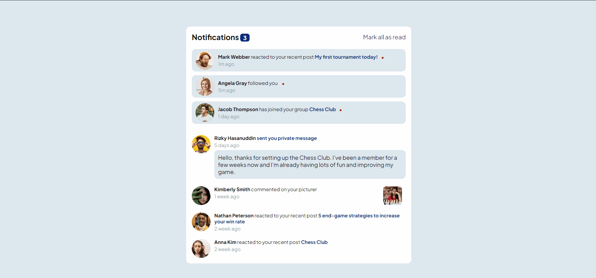

# Frontend Mentor | Notifications page

## Objetivo:
Um desafio do Frontend Mentor que consiste em criar uma página de notificações que exibe várias notificações de usuário. O usuário deve ser capaz de marcar todas as notificações como lidas ou interagir com cada notificação individualmente para marcar como lida ou não lida. O número de notificações não lidas deve ser atualizado dinamicamente conforme as interações do usuário.

## Funcionalidades:

### Exibição de Notificações:

Uma lista de notificações com informações como o nome do usuário, a ação que ele realizou (por exemplo, reagiu a um post, seguiu você, etc.), e o tempo desde que a ação foi realizada.
Algumas notificações têm detalhes adicionais, como um post específico ou um comentário.

### Interatividade:

Cada notificação pode ser clicada para alternar entre lida e não lida.
Um botão/link para "Marcar todas como lidas", que altera o estado de todas as notificações para lidas de uma vez.

### Indicador Visual:

As notificações não lidas têm um fundo diferenciado e um ponto vermelho ao lado, que desaparecem quando a notificação é marcada como lida.

### Atualização Dinâmica:

O número de notificações não lidas é exibido e atualizado automaticamente conforme o usuário interage com as notificações.

## Tecnologias utilizadas:

- HTML
- CSS
- JAVASCRIPT
